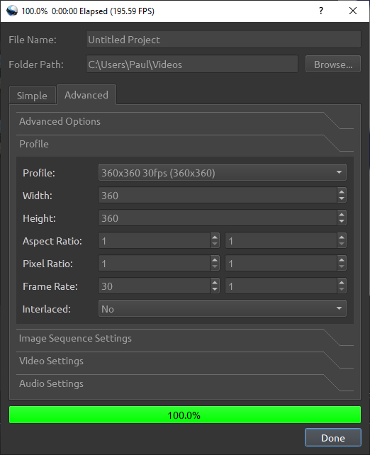

## Cutting/Cropping

### OBS

Pros
- Only the exact required rectangle is captured, so no further cropping required.

You can add a Crop filter when recording in OBS. This will let you record only a portion of the screen.

This means you don't have to do further processing to crop the video.

### FFMPEG

Pros
- Complete control over the export rectangle.

Cons
- Can't see the video, so might take a couple of attempts to get the right time slice and output rect.

Cutting a rect out of a source video, and cutting a time segment.

- `-y` overwrite the output file.
- `crop=width:height:x:y` crop size/location.
- `ss` start time.
- `-t` end time.

E.g.:

`ffmpeg -y -i "anim1.mkv" -filter:v "crop=480:220:16:226" -ss 00:00:05.5 -t 00:00:08 -c:a copy out.mp4`

### OpenShot Video Editor

Pros
- Can see the video while you are editing.

Cons
- It's a faff to crop a larger video to a smaller video size (especially if input video or export video is a custom size - i.e. not one of the pre-configured profiles).

Save a custom profile for dimensions you want to import/export.

Save profile with a filename, e.g. `C:\apps\OpenShot Video Editor\profiles\360x360x30fps`.

```
description=360x360 30fps
frame_rate_num=30
frame_rate_den=1
width=360
height=360
progressive=1
sample_aspect_num=1
sample_aspect_den=1
display_aspect_num=1
display_aspect_den=1
colorspace=709
```

Use this profile when working on the video and when exporting.


